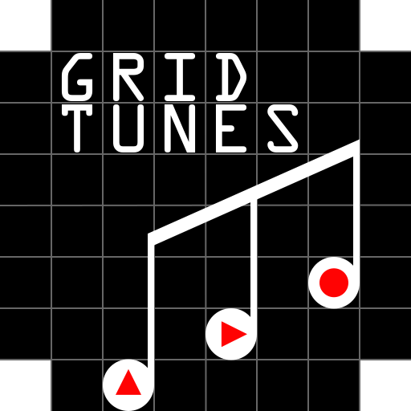

  

# Grid Tunes

`Grid Tunes` allows users create musical loops using blips moving  on a 2D grid and interacting with one another.

This repository contains a website that allows users to create musical loops by placing *blips* on a grid. These *blips* move around interacting with one another as well as the grid edges, producing sound in a repeating fashion. The notes are generated in Javascript using [Tone.js](https://tonejs.github.io/).

  

## Live Example

A live example of this website is hosted at [https://stuffjackmakes.com/gmgn/](https://stuffjackmakes.com/gmgn/).

## How it Works

Each *blip* on the grid has a direction (up, down, left, right) that it moves towards each time step. When multiple *blips* enter the same grid cell, they each rotate 90 degrees clockwise. Note that two *blips* may pass through one another if they are adjacent and facing towards each other - in which case each *blip* would end up in the cell where the other *blip* was previously. When a *blip* encounters the edge of the grid, it plays the note corresponding to its row or column (depending on if it hit the top/bottom or the left/right sides) and reverses direction.

## Limitations

* You cannot currently export any music created
* You cannot currently share music via a link
* Some loops created can be exceedingly long, and thus not seem like a loop while listening
* Having too many sounds going off may result in poor quality sound of some machines

## Setup

Host the `index.html` file with your software of choice and you're done!

## Author

Check out my other work at [stuffjackmakes.com](https://stuffjackmakes.com)